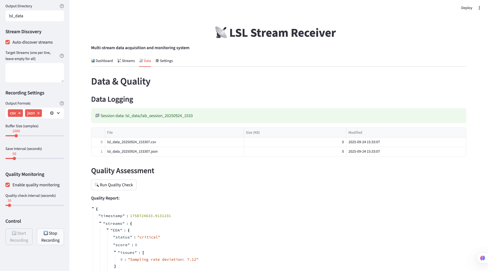
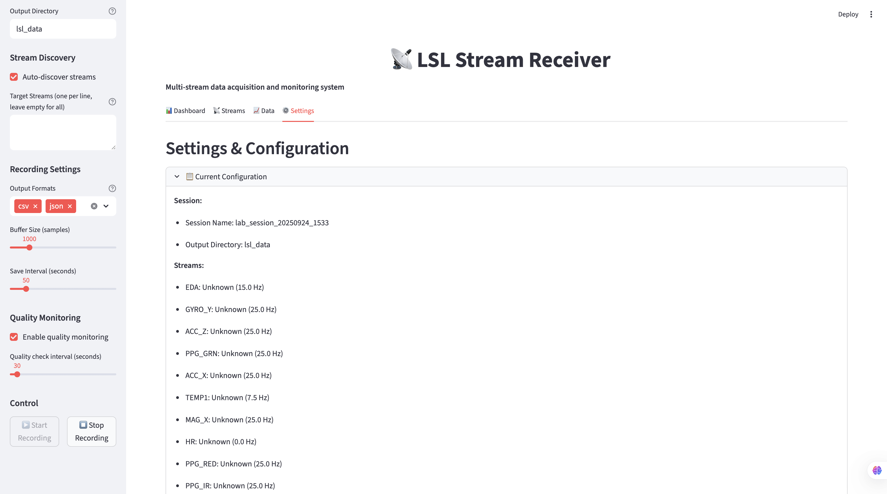

# LSL Stream Receiver

A comprehensive, lab-ready solution for receiving and managing data from multiple LSL (Lab Streaming Layer) streams. This repository provides both a Python library and a Streamlit web interface for easy configuration and monitoring.


*Main dashboard interface showing real-time stream monitoring and control*

## ✨ Features

🎯 **Multi-stream Support** - Receive data from multiple LSL streams simultaneously with synchronized timing
📊 **Real-time Monitoring** - Live visualization of stream data, status, and quality metrics
💾 **Flexible Logging** - Save data to CSV, JSON, or custom formats with comprehensive metadata
🔄 **Stream Management** - Automatic stream discovery, connection management, and reconnection
⚡ **Data Quality** - Built-in signal quality assessment and metadata collection
🖥️ **Web Interface** - User-friendly Streamlit app for configuration and monitoring
🔬 **Research Ready** - Comprehensive logging with timestamps, metadata, and quality metrics
🚀 **Automated Setup** - Comprehensive Makefile for easy installation and development

## Quick Start

### 🚀 One-Command Setup (Recommended)

```bash
git clone <repository-url>
cd lsl-stream-receiver
make setup          # Creates venv and installs everything
make app           # Starts the Streamlit web application
```

### 📦 Manual Installation

```bash
git clone <repository-url>
cd lsl-stream-receiver
python3 -m venv venv
source venv/bin/activate
pip install -r requirements.txt
```

### 💻 Usage Options

**Option 1: Web Interface (Easiest)**

The Streamlit web interface provides a user-friendly way to configure, monitor, and manage your LSL streams:

```bash
make app
# Open browser to http://localhost:8501
```

The interface includes:
- **Dashboard**: Real-time stream status and metrics
- **Stream Management**: Detailed view of connected streams with metadata
- **Data Tab**: View recent data samples and export options
- **Settings**: Configure recording parameters and quality monitoring


*Stream status dashboard showing connected streams, sample counts, and error monitoring*


*Detailed stream information including metadata, sampling rates, and quality metrics*

**Option 2: Python Script**

For programmatic access or integration into other applications:

```python
from lsl_receiver import StreamManager

# Create stream manager
manager = StreamManager()

# Start receiving data
manager.start_receiving()

# Access latest data
for stream_name, stream_data in manager.get_latest_data().items():
    print(f"{stream_name}: {stream_data}")

# Stop receiving
manager.stop_receiving()
```

**Option 3: Interactive Examples**

Explore different usage patterns with our example scripts:

```bash
make examples
# Select from menu of example scripts
```

### 📋 Available Make Commands

| Command | Description |
|---------|-------------|
| `make setup` | Create virtual environment and install dependencies |
| `make app` | Start the Streamlit web application |
| `make dev` | Start in development mode with hot reload |
| `make examples` | Run example scripts with interactive menu |
| `make test` | Run all tests |
| `make clean` | Clean up temporary files |
| `make lint` | Run code quality checks |
| `make format` | Format code with black |
| `make help` | Show all available commands |

## 🔧 Development & Automation

This repository includes a comprehensive Makefile that automates common development and usage tasks:

### 🏗️ Environment Setup
- **`make setup`** - Creates virtual environment and installs all dependencies
- **`make install`** - Updates dependencies in existing environment
- **`make venv-check`** - Verifies virtual environment setup

### 🎛️ Application Control
- **`make app`** - Start the Streamlit web application
- **`make dev`** - Start in development mode with hot reload
- **`make examples`** - Interactive menu to run example scripts

### 🛠️ Development Tools
- **`make test`** - Run unit tests
- **`make lint`** - Code quality checks (flake8, pylint)
- **`make format`** - Format code with black
- **`make clean`** - Remove temporary files
- **`make clean-all`** - Remove everything including virtual environment

### 📚 Documentation & Quality
- **`make docs`** - Generate documentation
- **`make health`** - Run system health check
- **`make status`** - Show project status

### 🚀 Quick Workflow
```bash
git clone <repository-url>
cd lsl-stream-receiver
make setup          # 🏗️ Setup everything
make app           # 🎛️ Start the app
make examples      # 📝 Try examples
make clean         # 🧹 Clean up
```

## Architecture

```
lsl-stream-receiver/
├── lsl_receiver/           # Core Python library
│   ├── __init__.py
│   ├── core.py            # Main receiver and stream management
│   ├── stream_manager.py  # Multi-stream coordination
│   └── utils.py           # Utility functions
├── streamlit_app/         # Web interface
│   ├── app.py            # Main Streamlit application
│   └── config.py         # Configuration management
├── examples/             # Usage examples
│   ├── basic_receiver.py
│   ├── csv_logger.py
│   └── real_time_plotter.py
├── docs/                # Documentation
│   ├── usage.md
│   └── api.md
└── tests/              # Unit tests
    ├── test_core.py
    └── test_integration.py
```

## Key Components

### StreamManager
- **Automatic Discovery**: Discovers and connects to available LSL streams
- **Multi-rate Support**: Manages multiple streams with different sampling rates
- **Resilient Connection**: Handles stream disconnections and reconnections
- **Synchronized Access**: Provides thread-safe, synchronized data access

### Data Logger
- **Multiple Formats**: Configurable output formats (CSV, JSON, HDF5)
- **Rich Metadata**: Comprehensive metadata collection and preservation
- **Quality Tracking**: Quality metrics and signal statistics
- **Session Management**: Organized, timestamped data sessions

### Streamlit Interface
- **Live Monitoring**: Real-time stream status and data visualization
- **Interactive Config**: Easy-to-use controls for all parameters
- **Quality Dashboard**: Built-in data quality assessment and alerts
- **Export Tools**: Flexible data export and analysis capabilities


## Use Cases

### 🔬 Research Data Collection
Perfect for collecting synchronized data across multiple research domains:
- **Physiological Signals**: EEG, ECG, EDA, EMG, GSR
- **Behavioral Data**: Eye tracking, motion capture, facial expressions
- **Environmental Sensors**: Temperature, humidity, light levels
- **Experimental Events**: Stimuli timing, participant responses

### 🧪 Lab Equipment Integration
Streamline your lab workflow with robust multi-device coordination:
- **Multi-device Sync**: Synchronize diverse instruments and sensors
- **Real-time Validation**: Live data quality checking and alerts
- **Automated Storage**: Hands-off data logging with metadata
- **Quality Monitoring**: Continuous signal quality assessment

### ⚙️ Development and Testing
Accelerate your development cycle with comprehensive testing tools:
- **Stream Simulation**: Generate test streams for validation
- **Protocol Testing**: Verify LSL protocol compliance
- **Performance Analysis**: Benchmark stream throughput and latency
- **Integration Testing**: Test with real and simulated devices

### 📊 Real-time Monitoring
Monitor your streams in real-time with comprehensive dashboards showing:
- Live signal quality metrics
- Connection status and error rates
- Data throughput and buffer levels
- Stream metadata and sampling rates

*Example monitoring session with multiple physiological sensors connected*

## Configuration

### Stream Discovery
- Automatic discovery of all available LSL streams
- Manual specification of target streams
- Stream type and metadata validation

### Data Storage
- Configurable output directories
- Multiple format support
- Metadata inclusion options
- Quality metrics logging

### Quality Control
- Signal quality assessment
- Missing data detection
- Sampling rate validation
- Stream stability monitoring

## 📸 Interface Gallery

### Dashboard Overview

*Main application interface with stream status and control panel*

### Stream Monitoring

*Real-time stream status showing connected sensors and data flow*

### Detailed Stream Information

*Comprehensive stream metadata and quality metrics*

### Quality Check

*Comprehensive stream metadata and quality metrics*


### Configuration Panel

*Settings and configuration interface for recording parameters*

## 🤝 Contributing

We welcome contributions from lab members! Please see our [contributing guidelines](docs/contributing.md) for details.

## 📄 License

MIT License - see LICENSE file for details.

## 🆘 Support

For questions or issues:
- Create an issue in this repository
- Contact the lab's technical support team
- Check the [documentation](docs/) for common solutions
- Review the [Quick Start Guide](docs/quick_start.md) for detailed setup instructions

---

**Made with ❤️ for the research community**
