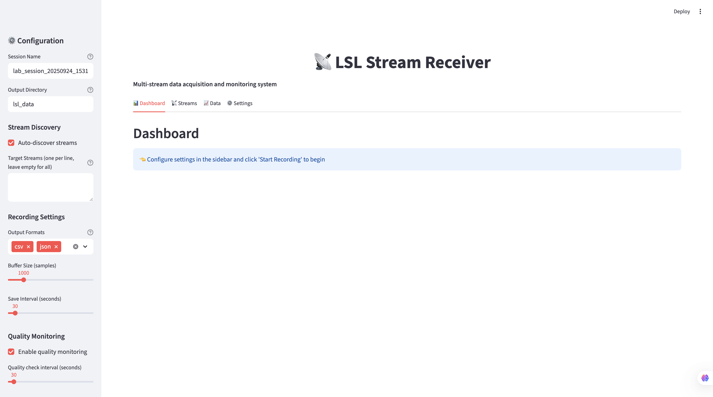

# LSL Stream Receiver

A comprehensive, lab-ready solution for receiving and managing data from multiple LSL (Lab Streaming Layer) streams. This repository provides both a Python library and a Streamlit web interface for easy configuration and monitoring.


*Main dashboard interface showing real-time stream monitoring and control*

## ✨ Features

🎯 **Multi-stream Support** - Receive data from multiple LSL streams simultaneously with synchronized timing
📊 **Real-time Monitoring** - Live visualization of stream data, status, and quality metrics
💾 **Flexible Logging** - Save data to CSV, JSON, or custom formats with comprehensive metadata
🔄 **Stream Management** - Automatic stream discovery, connection management, and reconnection
⚡ **Data Quality** - Built-in signal quality assessment and metadata collection
🖥️ **Web Interface** - User-friendly Streamlit app for configuration and monitoring
🔬 **Research Ready** - Comprehensive logging with timestamps, metadata, and quality metrics
🚀 **Automated Setup** - Comprehensive Makefile for easy installation and development

## Quick Start

### 🚀 One-Command Setup (Recommended)

```bash
git clone <repository-url>
cd lsl-stream-receiver
make setup          # Creates venv and installs everything
make app           # Starts the Streamlit web application
```

### 💻 Usage Options

**Option 1: Web Interface (Easiest)**
```bash
make app
# Open browser to http://localhost:8501
```

**Option 2: Python Script**
```python
from lsl_receiver import StreamManager
manager = StreamManager()
manager.start_receiving()
data = manager.get_latest_data()
manager.stop_receiving()
```

**Option 3: Interactive Examples**
```bash
make examples  # Select from menu of example scripts
```

### 📋 Available Make Commands

| Command | Description |
|---------|-------------|
| `make setup` | Create virtual environment and install dependencies |
| `make app` | Start the Streamlit web application |
| `make dev` | Start in development mode with hot reload |
| `make examples` | Run example scripts with interactive menu |
| `make test` | Run all tests |
| `make clean` | Clean up temporary files |
| `make lint` | Run code quality checks |
| `make format` | Format code with black |
| `make help` | Show all available commands |

## Architecture Overview

```
lsl-stream-receiver/
├── lsl_receiver/           # Core Python library
│   ├── core.py            # Main receiver and stream management
│   ├── data_logger.py     # Data logging functionality
│   └── quality_assessor.py # Quality assessment
├── streamlit_app/         # Web interface
│   └── app.py            # Main Streamlit application
├── examples/             # Usage examples
│   ├── basic_receiver.py
│   ├── csv_logger.py
│   └── real_time_plotter.py
├── docs/                # Documentation
│   ├── user_guide.md    # Detailed usage and examples
│   ├── development.md    # Development and API reference
│   ├── architecture.md   # System architecture details
│   └── contributing.md  # Contributing guidelines
└── tests/              # Unit tests
```

## 📖 Documentation

- **📚 [User Guide](docs/user_guide.md)** - Detailed usage examples, configuration, and tutorials
- **🔧 [Development Guide](docs/development.md)** - API reference, architecture details, and development setup
- **🤝 [Contributing](docs/contributing.md)** - Guidelines for contributing to the project
- **📝 [Quick Start](docs/quick_start.md)** - Step-by-step setup instructions

## Use Cases

### 🔬 Research Data Collection
Perfect for collecting synchronized data across multiple research domains:
- **Physiological Signals**: EEG, ECG, EDA, EMG, GSR
- **Behavioral Data**: Eye tracking, motion capture, facial expressions
- **Environmental Sensors**: Temperature, humidity, light levels
- **Experimental Events**: Stimuli timing, participant responses

### 🧪 Lab Equipment Integration
Streamline your lab workflow with robust multi-device coordination:
- **Multi-device Sync**: Synchronize diverse instruments and sensors
- **Real-time Validation**: Live data quality checking and alerts
- **Automated Storage**: Hands-off data logging with metadata
- **Quality Monitoring**: Continuous signal quality assessment

## 📄 License

MIT License - see LICENSE file for details.

## 🆘 Support

For questions or issues:
- Create an issue in this repository
- Contact the lab's technical support team
- Check the [documentation](docs/) for common solutions
- Review the [Quick Start Guide](docs/quick_start.md) for detailed setup instructions

---

**Made with ❤️ for the research community**
