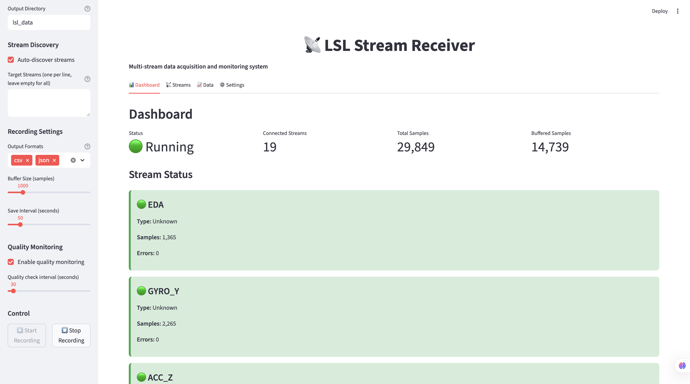

# LSL Stream Receiver User Guide

This comprehensive guide covers detailed usage examples, configuration options, and best practices for using the LSL Stream Receiver in your research projects.

## 📋 Table of Contents

- [Installation Options](#-installation-options)
- [Usage Examples](#-usage-examples)
- [Configuration](#-configuration)
- [Interface Gallery](#-interface-gallery)
- [Troubleshooting](#-troubleshooting)
- [Best Practices](#-best-practices)

## 🚀 Installation Options

### One-Command Setup (Recommended)

The fastest way to get started:

```bash
git clone <repository-url>
cd lsl-stream-receiver
make setup          # Creates venv and installs everything
make app           # Starts the Streamlit web application
```

### Manual Installation

For custom environments or specific requirements:

```bash
git clone <repository-url>
cd lsl-stream-receiver

# Create virtual environment
python3 -m venv venv
source venv/bin/activate  # On Windows: venv\Scripts\activate

# Install dependencies
pip install -r requirements.txt

# Start the application
make app
```

### Docker Installation (Alternative)

```bash
# Build the Docker image
make docker-build

# Run with Docker
docker run -p 8501:8501 lsl-stream-receiver
```

## 💻 Usage Examples

### Web Interface (Easiest)

The Streamlit web interface provides a user-friendly way to configure, monitor, and manage your LSL streams:

```bash
make app
# Open browser to http://localhost:8501
```

The interface includes:
- **Dashboard**: Real-time stream status and metrics
- **Stream Management**: Detailed view of connected streams with metadata
- **Data Tab**: View recent data samples and export options
- **Settings**: Configure recording parameters and quality monitoring


*Stream status dashboard showing connected streams, sample counts, and error monitoring*


*Detailed stream information including metadata, sampling rates, and quality metrics*

### Python Script Integration

For programmatic access or integration into other applications:

```python
from lsl_receiver import StreamManager

# Create stream manager with custom settings
manager = StreamManager(
    target_streams=['EEG', 'Physiological'],  # Optional: specific streams
    auto_discovery=True,                       # Auto-discover streams
    reconnect_attempts=3                       # Reconnection attempts
)

# Start receiving data
manager.start_receiving()

# Access latest data
for stream_name, stream_data in manager.get_latest_data().items():
    print(f"{stream_name}: {stream_data}")

# Get comprehensive status
status = manager.get_status_summary()
print(f"Connected streams: {len(status['stream_info'])}")
print(f"Total samples: {status['total_samples']}")

# Stop receiving
manager.stop_receiving()
```

### Data Logging with Metadata

```python
from lsl_receiver import StreamManager, DataLogger

# Setup logging
logger = DataLogger(
    output_dir="my_experiment",
    formats=['csv', 'json'],     # Output formats
    session_name="experiment_1", # Session identifier
    include_metadata=True,       # Include comprehensive metadata
    quality_metrics=True         # Compute quality metrics
)

# Receive with logging
manager = StreamManager()
manager.start_receiving(data_logger=logger)

# Your experiment code here...

# Stop and finalize
manager.stop_receiving()
logger.save_session_summary()
logger.close()
```

### Quality Monitoring

```python
from lsl_receiver import StreamManager, QualityAssessor

# Setup quality monitoring
assessor = QualityAssessor(
    check_interval=30.0,                    # Check every 30 seconds
    required_sampling_rate_tolerance=0.1,   # 10% tolerance
    max_missing_data_ratio=0.1              # Max 10% missing data
)

manager = StreamManager()

# Monitor quality during experiment
while experiment_running:
    quality_report = assessor.assess_quality(manager.get_stream_info())
    overall_quality = quality_report['overall_quality']

    if overall_quality < 0.8:
        print(f"⚠️ Quality degraded: {overall_quality".2f"}")
        # Take corrective action

    time.sleep(10)  # Check every 10 seconds
```

### Real-time Plotting

```python
import matplotlib.pyplot as plt
from lsl_receiver import StreamManager
import time

# Setup for real-time plotting
manager = StreamManager(target_streams=['EEG'])
manager.start_receiving()

plt.ion()  # Interactive mode
fig, ax = plt.subplots(figsize=(12, 6))

while True:
    data = manager.get_latest_data(n_samples=100)

    if 'EEG' in data:
        eeg_data = data['EEG'][-100:]  # Last 100 samples
        ax.clear()
        ax.plot(eeg_data)
        ax.set_title('Real-time EEG Data')
        plt.pause(0.1)

    time.sleep(0.1)  # Update every 100ms
```

## ⚙️ Configuration

### Stream Discovery

#### Automatic Discovery
```python
from lsl_receiver import StreamManager

# Discover all available streams
manager = StreamManager(auto_discovery=True)
streams = manager.discover_streams()
print(f"Found {len(streams)} streams:")
for name, info in streams.items():
    print(f"  - {name}: {info.type()} ({info.nominal_srate()} Hz)")
```

#### Targeted Discovery
```python
# Connect to specific streams only
manager = StreamManager(
    target_streams=['EEG', 'ECG', 'EyeTracking'],
    auto_discovery=False  # Manual stream selection
)
```

### Data Storage Configuration

#### Multiple Output Formats
```python
logger = DataLogger(
    output_dir="experiment_data",
    formats=['csv', 'json', 'parquet'],  # Multiple formats
    session_name="multi_modal_study",
    include_metadata=True,
    quality_metrics=True
)
```

#### Session Organization
```
experiment_data/
├── session_2025_01_24_1430/           # Timestamped session
│   ├── eeg_data.csv
│   ├── physiological_data.json
│   ├── metadata.json
│   └── quality_report.json
└── session_2025_01_24_1520/
    └── ...
```

### Quality Control Settings

#### Custom Quality Thresholds
```python
assessor = QualityAssessor(
    check_interval=60.0,                    # Check every minute
    required_sampling_rate_tolerance=0.05,  # 5% tolerance
    max_missing_data_ratio=0.05,            # Max 5% missing data
    min_connection_stability=0.95           # 95% connection stability
)
```

#### Real-time Quality Monitoring
```python
# Monitor quality throughout experiment
quality_history = []

while experiment_running:
    quality = assessor.assess_quality(manager.get_stream_info())
    quality_history.append(quality)

    if quality['overall_quality'] < 0.7:
        print("🚨 Quality degraded - check connections")
        # Alert researcher

    time.sleep(30)  # Check every 30 seconds
```

## 📸 Interface Gallery

### Dashboard Overview

*Main application interface with stream status and control panel*

### Stream Monitoring

*Real-time stream status showing connected sensors and data flow*

### Detailed Stream Information

*Comprehensive stream metadata and quality metrics*

### Quality Check Interface

*Built-in quality assessment and monitoring tools*

### Configuration Panel

*Settings and configuration interface for recording parameters*

### Real-time Data View

*Live data visualization during active recording sessions*

## 🔧 Troubleshooting

### Common Issues

#### No Streams Found
**Problem**: The application doesn't detect any LSL streams.

**Solutions**:
1. **Check LSL devices**: Ensure your LSL devices are running and streaming
2. **Network connectivity**: Verify network connectivity between devices
3. **Stream publication**: Ensure streams are being published to the correct network interface
4. **Firewall settings**: Check if firewall is blocking LSL traffic

```bash
# Debug: List all available streams
python -c "from pylsl import resolve_streams; streams = resolve_streams(); [print(f'{s.name()}: {s.type()}') for s in streams]"
```

#### Connection Drops
**Problem**: Streams disconnect frequently during recording.

**Solutions**:
1. **Increase reconnection attempts**: Modify the `reconnect_attempts` parameter
2. **Check network stability**: Monitor network connectivity
3. **System resources**: Ensure sufficient system resources
4. **Buffer sizes**: Adjust buffer sizes based on sampling rates

#### Missing Data
**Problem**: Data gaps appear in recorded streams.

**Solutions**:
1. **Verify stream configuration**: Check device-specific settings
2. **Monitor sampling rates**: Ensure consistent sampling
3. **Check system performance**: Monitor CPU and memory usage
4. **Buffer management**: Adjust buffer sizes and flush intervals

### Performance Optimization

#### High CPU Usage
```python
# Reduce update frequency
manager = StreamManager(
    update_interval=0.1,  # Update every 100ms instead of default 50ms
    buffer_size=1000      # Smaller buffers reduce memory usage
)
```

#### Memory Management
```python
# Regular data export to prevent memory buildup
logger = DataLogger(
    output_dir="data",
    auto_save_interval=300,  # Auto-save every 5 minutes
    max_memory_buffer=10000  # Limit buffer size
)
```

#### Disk Space Management
```python
# Use compressed formats for large datasets
logger = DataLogger(
    formats=['parquet'],  # More efficient than CSV/JSON
    compression='gzip'    # Enable compression
)

# Implement data rotation
# Export and clear old data periodically
logger.export_session_data()
logger.clear_buffers()
```

## 📚 Best Practices

### Research Data Collection

#### Session Management
```python
# Start with clear session identification
logger = DataLogger(
    session_name=f"participant_{participant_id}_condition_{condition}",
    include_metadata=True,
    metadata={
        'participant_id': participant_id,
        'condition': condition,
        'experimenter': 'Dr. Smith',
        'date': datetime.now().isoformat()
    }
)
```

#### Multi-modal Data Synchronization
```python
# Ensure temporal alignment across streams
manager = StreamManager(
    target_streams=['EEG', 'ECG', 'EyeTracking', 'Stimuli'],
    sync_streams=True,  # Enable cross-stream synchronization
    max_time_offset=0.001  # 1ms maximum offset tolerance
)
```

#### Quality Assurance Workflow
```python
def quality_assurance_check(manager, assessor, threshold=0.8):
    """Comprehensive quality check before starting experiment."""
    quality = assessor.assess_quality(manager.get_stream_info())

    checks = [
        quality['overall_quality'] >= threshold,
        all(stream['connection_stability'] >= 0.9 for stream in quality['streams'].values()),
        all(stream['sampling_rate_deviation'] < 0.05 for stream in quality['streams'].values())
    ]

    return all(checks), quality
```

### Lab Equipment Integration

#### Multi-device Coordination
```python
# Coordinate multiple lab instruments
equipment_manager = StreamManager(
    target_streams=[
        'EEG_Amp', 'ECG_Monitor', 'Eye_Tracker',
        'Stimulus_PC', 'Response_Box', 'Environmental'
    ]
)

# Start synchronized recording
equipment_manager.start_receiving()
```

#### Automated Quality Monitoring
```python
# Continuous quality monitoring with alerts
def monitor_experiment_quality(manager, assessor, alert_callback):
    while experiment_running:
        quality = assessor.assess_quality(manager.get_stream_info())

        if quality['overall_quality'] < 0.7:
            alert_callback(f"Quality degraded: {quality['overall_quality']".2f"}")

        time.sleep(30)
```

### Development and Testing

#### Stream Simulation for Testing
```python
from lsl_receiver.testing import StreamSimulator

# Create simulated streams for testing
simulator = StreamSimulator(
    streams={
        'EEG': {'channels': 32, 'srate': 500, 'type': 'EEG'},
        'ECG': {'channels': 3, 'srate': 250, 'type': 'ECG'},
        'Stimuli': {'channels': 1, 'srate': 100, 'type': 'Stimuli'}
    }
)

# Start simulation
simulator.start()

# Test your receiver
manager = StreamManager()
manager.start_receiving()

# Stop simulation
simulator.stop()
```

#### Performance Benchmarking
```python
def benchmark_performance(manager, duration=60):
    """Benchmark stream reception performance."""
    import time

    start_time = time.time()
    samples_received = 0

    while time.time() - start_time < duration:
        data = manager.get_latest_data()
        samples_received += sum(len(d) for d in data.values())
        time.sleep(0.1)

    throughput = samples_received / duration
    print(f"Average throughput: {throughput".1f"} samples/sec")

    return throughput
```

## 📄 Support and Resources

### Getting Help

1. **Documentation**: Check this user guide and related docs
2. **Examples**: Explore the examples/ directory
3. **Issues**: Search existing GitHub issues
4. **Community**: Ask questions in GitHub Discussions
5. **Contact**: Reach out to the lab's technical support team

### Additional Resources

- **📚 [Technical Documentation](README.md)** - Comprehensive technical reference
- **🔧 [Development Guide](development.md)** - For contributors and advanced users
- **🤝 [Contributing Guidelines](contributing.md)** - How to contribute to the project
- **API Reference**: Built-in docstrings and type hints

---

*This user guide is maintained by the lab's technical team. For updates or corrections, please create an issue or submit a pull request.*
